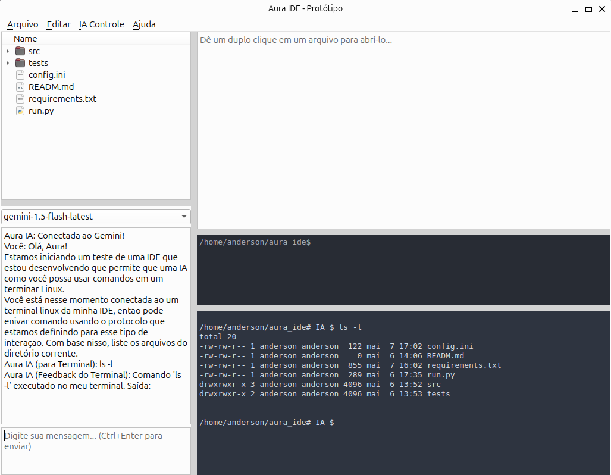

# Aura IDE - Proof-of-Concept (Archived)



**Aura IDE is an experimental proof-of-concept project exploring the idea of an Integrated Development Environment (IDE) where a human developer and an AI assistant (powered by a Large Language Model like Google's Gemini) can collaboratively develop software. A key and unique feature explored was granting the AI direct access to its own dedicated Linux terminal to execute commands.**

This project was developed iteratively with the AI assistant ("Aura") itself guiding and contributing to its own creation process.

## Core Idea & Vision

The vision behind Aura IDE was to move beyond AI chatbots or simple code suggestion tools. The aim was to empower an AI to be an active, hands-on partner in the development lifecycle, capable of:

*   Understanding complex development tasks through a chat interface.
*   Executing system commands in a dedicated, sandboxed (within a VM) Linux terminal.
*   (Future goals) Reading and writing files, modifying code directly in the editor, and navigating the project structure.

The ultimate goal was to create a more seamless and powerful Dev-AI workflow, where the AI could take on more significant parts of the implementation under the developer's guidance and supervision, significantly speeding up development and allowing the developer to focus on higher-level design and strategy.

## Current Status: Archived

This project is currently **archived**. A successful proof-of-concept was achieved, demonstrating:

*   A functional GUI built with Python and PySide6.
*   Integration with an LLM API (Google Gemini).
*   A dedicated terminal for the AI where it successfully executed a Linux command (`ls -l`) based on a chat instruction.

However, further development faced challenges primarily related to:

1.  **LLM Context Limitations via API:** Managing and sending extensive context (full chat history, file contents, project state) for each API call to maintain the AI's "awareness" can be inefficient, costly, and hit token limits.
2.  **Hardware for Local LLMs:** The ideal scenario of running a sufficiently powerful LLM locally for direct, low-latency environment access requires significant hardware resources (GPU, VRAM) which were not available to the developer at the time of this project.

While the core mechanics were proven feasible, these external factors made scaling the AI's "awareness" and agency to the desired level impractical for now.

## Features Implemented (Proof-of-Concept)

*   **Graphical User Interface (PySide6):**
    *   File Browser (`QTreeView` with `QFileSystemModel`).
    *   Code Editor area (`QPlainTextEdit` for displaying file content).
    *   Interactive User Terminal (`QProcess` integrated with `QPlainTextEdit`).
    *   AI Chat Interface:
        *   Multi-line input (`Ctrl+Enter` to send).
        *   Display area for conversation history.
        *   `QComboBox` for (future) AI model selection.
    *   Dedicated AI Terminal (`AITerminalWidget`): Visually distinct terminal for AI command execution.
*   **AI Integration (Google Gemini):**
    *   Connection to Gemini API via `google-generativeai` library.
    *   Basic chat history management sent with API requests for context.
    *   Parsing AI responses to identify and execute commands in the AI's terminal.
    *   **Successful demonstration of the AI executing an `ls -l` command in its terminal based on a chat instruction.**
*   **API Abstraction:**
    *   Basic `BaseAIProvider` class.
    *   Implementations for `DeepSeekProvider` (initially) and `GeminiProvider`.
*   **Configuration:**
    *   API keys managed via an external `config.ini` file (gitignored).

## Technologies Used

*   **Python 3**
*   **PySide6** (Qt for Python) for the GUI
*   **Google Gemini API** (via `google-generativeai` library)
*   (Initially explored DeepSeek API)

## Setup (Basic)

1.  Clone the repository.
2.  Create and activate a Python virtual environment:
    ```bash
    python -m venv .venv
    source .venv/bin/activate  # On Linux/macOS
    # .venv\Scripts\activate   # On Windows
    ```
3.  Install dependencies:
    ```bash
    pip install -r requirements.txt
    ```
4.  Create a `config.ini` file in the root directory of the project with your Google Gemini API key:
    ```ini
    [API_KEYS]
    GEMINI_API_KEY = YOUR_GEMINI_API_KEY_HERE
    ```
    *(Ensure this file is in your `.gitignore` if you fork/clone and add your own keys).*

## How to Run

From the root directory of the project (with the virtual environment activated):
```bash
python run.py

```

## Future Outlook

The core ideas and the initial proof-of-concept for Aura IDE remain compelling. Future advancements in:
.Smaller, more efficient, and capable local LLMs.
.Larger context windows and more efficient context management for APIs.
.More accessible powerful hardware for local AI.

could make revisiting and significantly expanding this project highly feasible. The concept of an AI with direct, supervised agency within a development environment holds immense potential for the future of software development.
Acknowledgements

This project was a fascinating collaborative exploration between a human developer and "Aura" (an instance of Google's Gemini, acting as an AI development partner). The iterative process of ideation, design, coding, and debugging was a key part of the journey and learning experience.